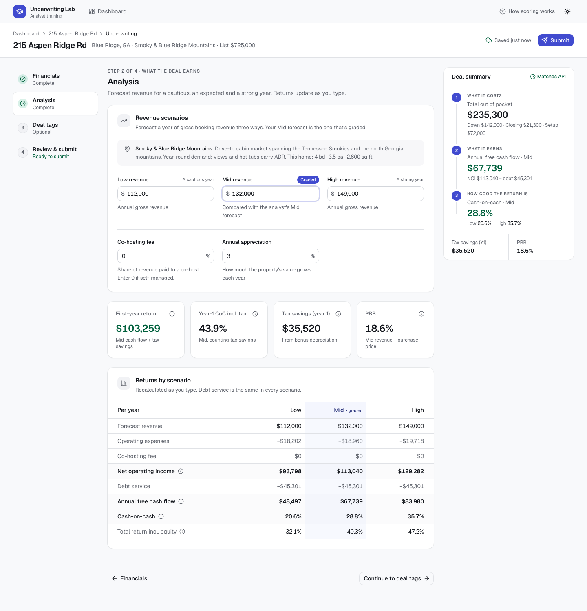
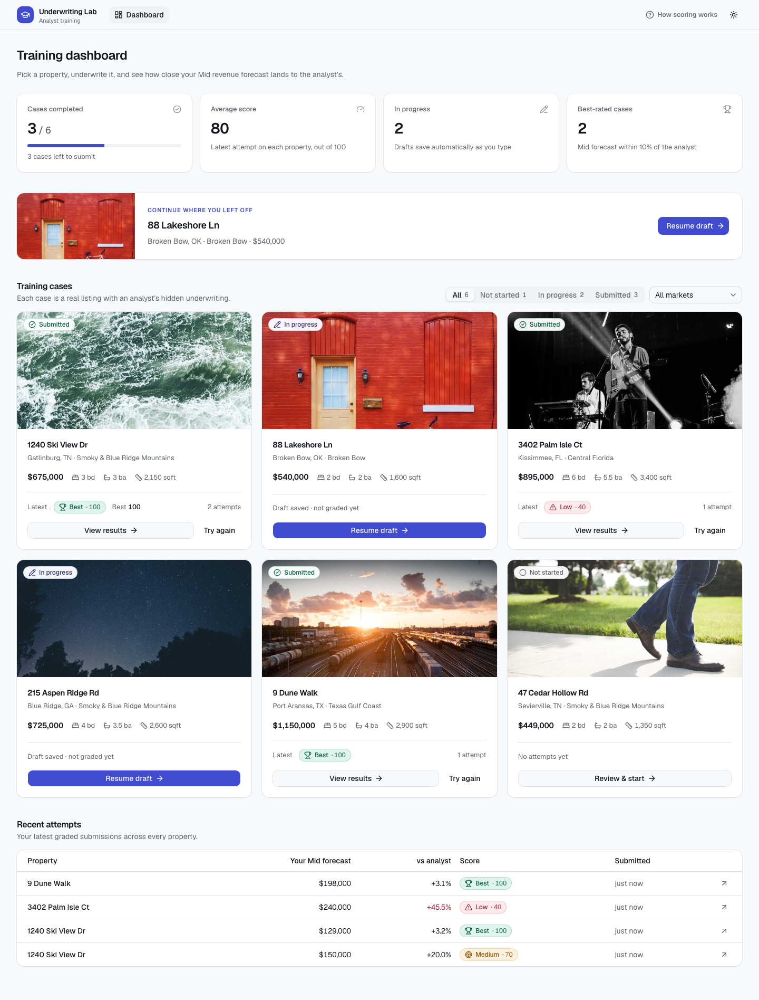
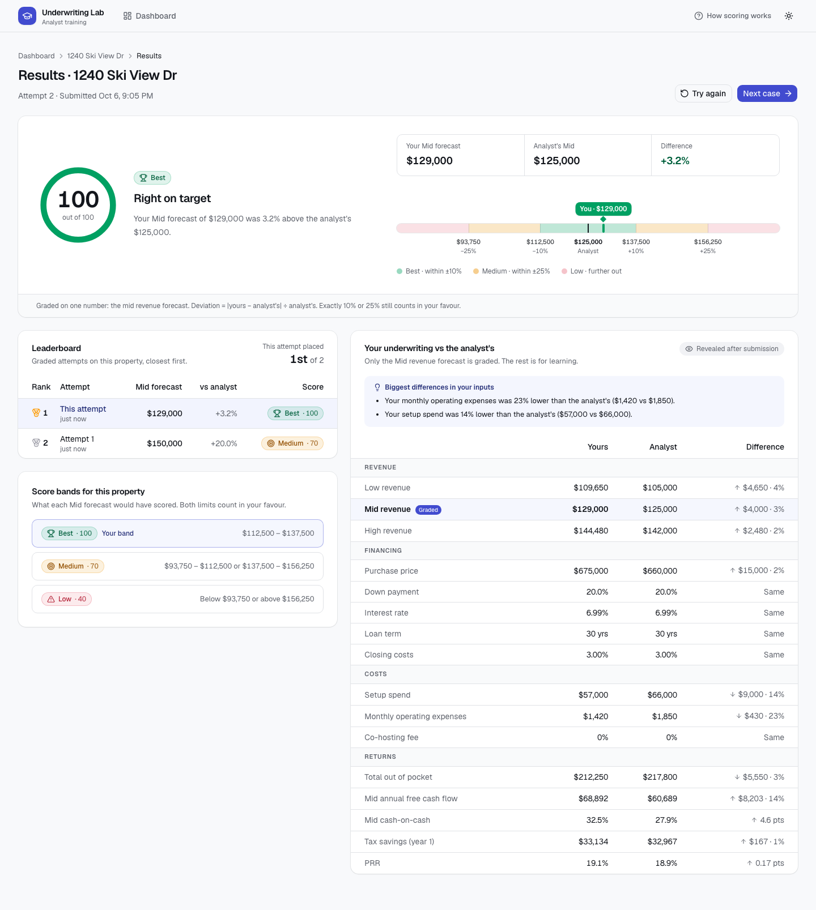

# Underwriting Lab

A training platform where new analysts practise underwriting short-term rental properties. A trainee picks a property, works through the underwriting, and submits it. They then see how close their **Mid revenue forecast** landed to the analyst's hidden reference, what that scored, and where it ranks on the leaderboard.

This repository is the Frontend Engineer Assessment submission. `frontend/` is the new work; `backend/` is the provided FastAPI service, unchanged.



| Dashboard | Results |
|---|---|
|  |  |

## Quick start

You need **Docker** (Docker Desktop, or Colima on macOS) and **Node.js 20.9+**.

```bash
# 1. The API: Postgres + FastAPI, migrated and seeded on first start
cd backend
docker compose up -d --build --wait      # http://localhost:8000/docs

# 2. The app
cd ../frontend
npm install
npm run dev                               # http://localhost:3000
```

The app talks to the API through its own `/api/backend/*` route, so there is no CORS setup. If the API runs somewhere other than `http://localhost:8000`, tell the app where:

```bash
cp .env.example .env.local    # then edit API_BASE_URL, e.g. http://localhost:8001
```

To run the API on another port: `API_PORT=8001 docker compose up -d --wait` in `backend/`.

## Tests

From `frontend/`:

```bash
npm run e2e               # one command, unattended: starts the backend, installs Chromium,
                          # builds the app and runs every Playwright test
npm run test:e2e:mocked   # Playwright against recorded API fixtures; no Docker needed
npm test                  # unit tests (Vitest): calculations, mappers, scoring, fixtures
npm run e2e:report        # open the HTML report from the last run
```

| Suite | Tests | What it covers |
|---|---|---|
| Playwright · live | 34 | The primary path end to end; 22 data-driven scoring cases (every property × every band, plus the inclusive boundaries); validation; autosave and persistence; the leaderboard |
| Playwright · mocked | 8 | Failed saves, failed and rejected submissions, an API outage, empty data, the reference-underwriting guard |
| Vitest | 45 | The calculation port against the backend's own test vectors, unit conversion, review model, scoring copy, fixture contracts |

The full suite takes about 90 seconds. [docs/TESTING.md](docs/TESTING.md) covers the fixture and case-generation strategy, determinism, and how to debug a failure. It includes a [real failure's artifacts](docs/failure-example/).

## How it works

1. **Dashboard.** Shows progress, average score, a "next up" case, every property with its status and scores, and recent attempts.
2. **Property brief.** Shows the listing, the market and what the trainee is graded on, before they start.
3. **Workspace.** Has four steps: Financials, Analysis, Deal tags, and Review & submit. A deal summary panel keeps the brief's cost → earnings → return chain visible the whole time. It updates as the trainee types and confirms that it matches the API's calculation.
4. **Results.** Shows the score, a plain-language explanation ("4.0% above the analyst's $125,000") and where the forecast landed on the scoring bands. It also shows the leaderboard, and the analyst's underwriting side by side with the trainee's, revealed only after submission.

[docs/DESIGN.md](docs/DESIGN.md) explains the workflow and interface decisions.

## Stack

| | |
|---|---|
| Framework | Next.js 16 (App Router, Turbopack), React 19, TypeScript (strict) |
| UI | shadcn/ui (Radix), Tailwind CSS 4, lucide icons, light and dark themes |
| Data | TanStack Query 5, with every API response validated by Zod 4 |
| Forms | React Hook Form with a Zod resolver |
| Tests | Playwright 1.63, Vitest 5 |

## Project structure

```
frontend/
├── src/
│   ├── app/                     # routes: /, /properties/[zpid], /underwritings/[id], /submissions/[id]
│   │   └── api/backend/[...path]/route.ts   # same-origin proxy to FastAPI
│   ├── components/              # shared UI: badges, page chrome, states (+ shadcn in ui/)
│   ├── features/                # one folder per screen: dashboard, property, workspace, results
│   └── lib/
│       ├── api/                 # Zod schemas, fetch client, endpoints, TanStack Query hooks
│       ├── underwriting/        # pure domain logic: fields, calc, form schema, mappers, review
│       ├── scoring.ts           # deviation copy, band ranges, leaderboard ranking
│       └── format.ts, parse.ts  # number formatting and parsing
├── e2e/                         # Playwright: live/, mocked/, fixtures/, support/
├── tests/unit/                  # Vitest
└── scripts/                     # e2e runner, fixture capture, screenshots
docs/                            # design, testing, screenshots, failure example
backend/                         # provided API (unchanged)
```

## Assumptions and trade-offs

- **Leaderboard = graded attempts.** The API has no users, so each graded attempt on a property is one leaderboard entry, ranked by closeness to the analyst. With real identities, the same ranking works per trainee.
- **The analyst's numbers are revealed after submitting.** The brief only requires hiding them while the trainee works. Showing them afterwards is the most useful feedback. As a result, a retry can copy the answer. A real deployment might delay the reveal or cap retries.
- **Submitted attempts are locked.** The API would accept edits to a submitted draft, but the UI shows a locked notice and offers a new attempt so grades stay meaningful.
- **Tax inputs are prefilled** with the brief's standard 20 / 25 / 60 / 37%. They are clearly marked and stay editable. The purchase price is prefilled from the listing.
- **Out of scope:** comp sets, deal pitch and notes, bedrooms and sleeps, renovation level and deal complexity. The API accepts these fields, but the brief scopes the screens without them.
- **Client-side data fetching.** Pages are server components that render client feature modules, and data loads in the browser through TanStack Query. That suits a highly interactive internal tool, and it lets Playwright control every API response. [DESIGN.md](docs/DESIGN.md) has the reasoning.
- **Desktop first.** The workspace is designed for a laptop or larger. It still works on tablets and phones: the stepper becomes tabs and the deal summary moves into a bottom sheet.
- **CI.** `.github/workflows/e2e.yml` runs lint, typecheck, unit tests and the full Playwright suite with Docker, and uploads the report. It has not run yet because the repository hasn't been pushed.
